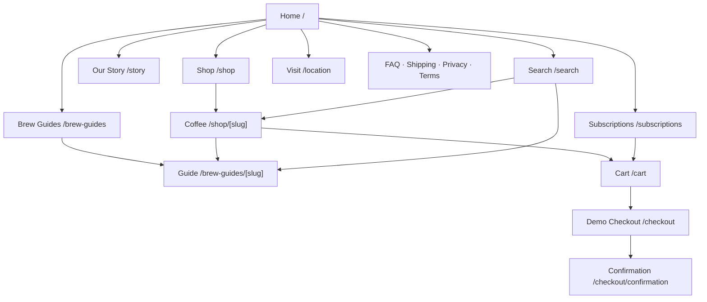
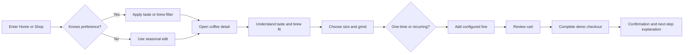
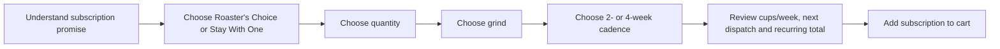
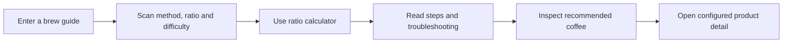

# ALDER ROASTERS — Phase 3 UX Architecture & Interaction Specification

**Status:** Implementation baseline

**Inputs:** Phase 1 PRD and Phase 2 Brand & Design Strategy

**Scope:** Information architecture, user flows, screen/state inventory, low-fidelity layout specifications and interaction contracts
**Not included:** Visual design, final copy, imagery or production UI

## 1. Phase goal

Translate ALDER's “Quietly exact” strategy into a complete, testable experience structure. The primary product promise is that a visitor can move from curiosity to a confident coffee choice without first learning specialist terminology.

### UX thesis

The experience alternates between three modes:

1. **Desire:** sensory imagery and a concise point of view.
2. **Orientation:** familiar language, clear paths and progressive detail.
3. **Decision:** stable facts, explicit controls and transparent consequences.

Every primary route must know which mode it is serving. Pages may transition between modes, but a single section should not attempt all three equally.

## 2. Final MVP information architecture



### Primary navigation

- Shop
- Subscriptions
- Our Story
- Brew Guides

### Utilities

- Search
- Cart with item count
- Menu on narrow layouts

Locations remains a footer path named **Visit**. Account is omitted because it would advertise an unavailable capability.

### Route rules

- `/shop` is the only canonical catalogue URL. Filters and sort use search parameters.
- Product and guide slugs are stable, human-readable and generated from typed content.
- `/search` query results are not indexed.
- `/cart`, `/checkout` and confirmation are not indexed.
- Missing product or guide content produces a useful 404, never a generic application error.

## 3. Core user flows

### Purchase flow



### Subscription flow



### Learn-to-buy flow



## 4. Global screen anatomy

All public pages use:

1. Skip link.
2. Optional announcement bar with one message and dismiss control only when genuinely needed.
3. Header with stable navigation, search and cart.
4. Main landmark with one page-level heading.
5. Contextual continuation module where useful.
6. Footer index, newsletter demonstration and fictional-project disclosure.

The header must not conceal navigation behind a menu on layouts wide enough to show four labels. Sticky behaviour is allowed after the first content region but may not consume more than roughly 12% of a short viewport.

## 5. Low-fidelity page specifications

### Home

```text
┌──────────────── Header: logo | primary navigation | search | cart ────────────────┐
│ HERO: proposition + short support + Shop current coffees                          │
│       dominant product/process image with intentional mobile crop                 │
├────────────────────────────────────────────────────────────────────────────────────┤
│ SEASONAL EDIT: section heading/action + 3–4 coffee plates                          │
├────────────────────────────────────────────────────────────────────────────────────┤
│ TASTE ENTRY: two-axis explanation + accessible preference controls + matches       │
├────────────────────────────────────────────────────────────────────────────────────┤
│ BRAND PROOF: documentary image + 3 sourcing/roasting principles                    │
├────────────────────────────────────────────────────────────────────────────────────┤
│ SUBSCRIPTION: service proposition + example next box + configure action            │
├────────────────────────────────────────────────────────────────────────────────────┤
│ BREW GUIDE: one useful guide, ratio preview, recommended coffee                    │
├────────────────────────────────────────────────────────────────────────────────────┤
│ VISIT: one flagship image + essential location details                             │
└──────────────── Footer: index | newsletter demo | disclosure ──────────────────────┘
```

Rules:

- The hero has one primary action. Secondary story access is a text link.
- Seasonal products appear before company history.
- Taste entry links to URL-backed catalogue results and remains useful without animation.
- Only one dark editorial chapter is used before the footer.

### Shop

```text
Page title + concise guide to the seasonal range
Result count + sort
Desktop: filter column | product grid
Mobile: filter button with active count | sort | product list/grid
Active-filter summary and clear-all
Zero-result recovery in the grid region
Seasonality note and link to sourcing approach
```

Filter order: flavour character → brew method → availability. Country and process remain product facts, not MVP filters.

Product plate hierarchy: image → name → origin → plain-language taste phrase → price. Process and variety do not appear on cards unless they distinguish otherwise similar products.

### Product detail

```text
Breadcrumb
Gallery                              Purchase summary
                                     Name / origin
                                     Taste sentence
                                     Price / availability
                                     Size control
                                     Grind control + guidance
                                     One-time / subscribe control
                                     Recurrence disclosure
                                     Add to cart
Trust row: roast schedule · shipping · demo disclosure where needed
Taste position + written equivalent
Coffee story: place → process → roast → cup
Recommended brew methods
Related guide
One current taste-adjacent coffee
```

On narrow layouts, purchase summary follows the first decisive product image. The add control is not sticky until scroll testing proves it does not obscure content or form feedback.

### Subscriptions

```text
Proposition + flexibility/dispatch facts
How it works: choose → roast → dispatch → brew
Plan selector: Roaster's Choice | Stay With One
Configuration: quantity → grind → cadence
Live summary: contents · cups/week estimate · next dispatch · recurring total
Add subscription
FAQ focused on pause, change, billing and shipping
```

All choices remain in one page flow. Do not split four simple decisions into a wizard. On mobile, the summary follows the current control group and repeats compactly before the final action.

### Cart

```text
Page title
Line items: image, configured attributes, purchase type, unit price
Quantity edit / remove
Subscription terms per recurring line
Subtotal and fictional shipping threshold
Demo-checkout disclosure
Checkout action
Continue shopping
```

An empty cart includes one sentence, a Shop action and up to three seasonal suggestions. No countdowns, urgency or automatic add-ons.

### Demonstration checkout

```text
Demo banner and no-real-payment statement
Checkout steps / progress text
Contact
Shipping address
Delivery method
Demo payment (preselected; no card fields)
Order review with recurring lines called out
Place demo order
```

Desktop uses form plus sticky order summary. Mobile keeps summary collapsible but exposes total and recurring status without expansion. Submission produces an order-like reference generated locally and navigates to confirmation without transmitting personal information.

### Confirmation

State clearly that no real order or payment was created. Summarise the fictional order, expected fictional next step and provide paths to a brew guide and shop. Do not imply an email was sent.

### Brew guide index and detail

Index groups by method complexity rather than publishing date. Detail begins with time, difficulty, equipment and base ratio; steps follow; troubleshooting and recommended coffees come after the primary method. Ratio calculation is progressive enhancement.

### Search

Search products and guides from one field. Results group by content type, expose matching context and update on explicit submit or a short debounce. The URL preserves the query. Empty query explains what can be searched; no result suggests flavour, origin or brew-method terms.

### Our Story and Visit

Story leads with belief, then evidence, company history and sourcing rules. Visit prioritises address, current fictional hours, access information, amenities and map link before editorial atmosphere.

## 6. Interaction contracts

### Catalogue filters

- Filter values are represented in the URL.
- Back/forward navigation restores values and scroll position where possible.
- Changing a filter updates result count and announces it politely.
- Focus remains on the changed control; results do not steal focus.
- Mobile sheet applies selections with an explicit “Show N coffees” action.
- Clearing filters retains the current sort unless the user resets all.

### Product configuration

- Default size: 250g.
- Default grind: whole bean, with an explanation rather than an assumption that everyone owns a grinder.
- Default purchase type: one-time.
- Subscription defaults to every four weeks after explicitly selected.
- Invalid combinations are disabled and accompanied by a reason.
- Price and recurrence text update in the same stable region.

### Taste map

- Inputs are optional preference controls; product positions are content data.
- Axes use familiar language: bright/comforting and delicate/full.
- The visual map is never the only representation.
- Keyboard controls and standard filters produce identical results.
- Reduced motion removes product reflow animation.

### Cart

- Cart line identity is product + size + grind + purchase plan + cadence.
- Adding an identical line increases quantity; a different configuration creates a new line.
- Quantity is an integer from 1–10.
- Persisted data is versioned, parsed defensively and reconciled with current catalogue data.
- Price and product truth come from current content, not persisted client values.
- Cart drawer is optional convenience; `/cart` remains authoritative.

### Checkout

- Field errors appear on blur only when useful and on submit always.
- Submit focuses an error summary linked to invalid fields.
- Values survive client-side validation failures.
- The form never includes credit-card, identity-document or unnecessary personal fields.
- Confirmation state is generated only after valid data and an explicit demo submission.
- Checkout data is not persisted after confirmation.

## 7. State inventory

| Surface         | Required states                                                                  |
| --------------- | -------------------------------------------------------------------------------- |
| Navigation      | default, menu open, search open, scrolled, focus-visible                         |
| Catalogue       | loading boundary, results, filtered, zero results, malformed query recovery      |
| Product         | available, low stock, sold out, invalid slug, configured, adding, added          |
| Subscription    | default, partially configured, valid, incompatible choice, added                 |
| Search          | empty query, results, grouped results, no results, invalid query                 |
| Cart            | empty, populated, mixed one-time/recurring, quantity limit, recovered stale line |
| Checkout        | pristine, validating, invalid, submitting, submitted, duplicate-submit prevented |
| Newsletter demo | idle, invalid, success explanation, simulated failure                            |
| Media           | loading, loaded, unavailable fallback, reduced motion                            |
| Global          | 404, unexpected error, offline/navigation retry where applicable                 |

## 8. Responsive contracts

### Narrow mobile: 320–399px

- Single primary column and 16px outer margin.
- Product grid is one column where copy/image quality benefits; two columns are not forced.
- Header shows wordmark, menu, search and cart without overlapping at 200% zoom.
- Forms remain one column; option controls wrap rather than horizontally scroll.
- Gallery and product summary preserve a complete first image and core purchase facts.

### Large mobile: 400–767px

- Product grid may use two columns only if cards retain readable copy.
- Selected controls and summaries remain near each other.
- Full-screen menu/filter sheets use native document flow and visible close controls.

### Tablet: 768–1023px

- Eight-column composition.
- Product grid generally two columns; filters may remain a sheet.
- Product gallery and summary may sit side by side only if each retains a useful minimum width.

### Laptop: 1024–1439px

- Twelve-column grid, three-column product catalogue, inline filters.
- Product gallery and purchase summary split approximately 7/5 columns.
- Checkout form and summary split approximately 7/5 columns.

### Wide: 1440px+

- Content max widths prevent stretched reading and oversized cards.
- Additional width becomes margin or deliberate image bleed, not more catalogue columns by default.

### Content-stress tests

- 200% zoom at 1280px.
- 320px width.
- 320px viewport height for sticky/overlay collisions.
- Long product names and four tasting notes.
- MYR prices up to five digits.
- Browser text-size increase.
- Reduced motion and forced-colour modes.

## 9. Content model implications

### Coffee

Required fields: slug, name, status, featured rank, origin hierarchy, producer, altitude, varieties, process, harvest, roast intent, taste notes, taste coordinates, brew methods, story stages, sizes, grind compatibility, one-time prices, subscription eligibility, image set and related guide IDs.

### Subscription

Plan ID, name, promise, available quantities, compatible grinds, cadences, price rules, savings statement, dispatch rule, flexibility terms and optional fixed coffee ID.

### Guide

Slug, title, method, difficulty, time, base coffee/water ratio, equipment, steps, troubleshooting, compatible brew method tag, image set and recommended coffee IDs.

### Location

Name, fictional address, coordinates for display only, hours, contact, accessibility details, amenities, transit/parking guidance and image set.

## 10. Analytics event plan

Only privacy-conscious product events are needed:

- `view_product`
- `apply_shop_filter`
- `select_purchase_type`
- `configure_subscription`
- `add_to_cart`
- `begin_demo_checkout`
- `complete_demo_checkout`
- `use_brew_ratio`
- `search_content`

Events contain content IDs and option categories, never contact/address form values or free-text search beyond a separately reviewed policy.

## 11. Accessibility acceptance tests

- Navigate every critical flow using keyboard only.
- Menu, filter sheet and cart drawer contain and return focus correctly.
- All configurations expose name, state and value.
- Result/cart updates are announced once without excessive verbosity.
- Taste map has an equivalent text/filter path.
- Checkout errors are understandable and programmatically associated.
- Page landmarks and headings remain logical at all responsive layouts.
- Images have content-specific alternatives; product-pack reverse text is present as HTML.
- All primary actions retain 44px targets and visible focus.
- No state depends on colour, hover or motion.

## 12. MVP priority and cut line

### Must ship

Home, Shop, product detail, Subscriptions, cart, demo checkout/confirmation, search, Story, three brew guides, Visit, policies, URL-backed filters, responsive navigation, accessible forms and all documented edge states.

### Ship if quality remains high

Interactive taste-map filtering, ratio calculator, cart drawer and subtle catalogue reflow.

### Cut first

Packaging loupe, audio pronunciation, comparison slider, advanced timers, elaborate page transitions and recently viewed products.

## 13. Phase 3 handoff

The information architecture, flows, content requirements and interaction contracts are explicit enough to begin the technical foundation. Phase 4 must establish domain models and tests before page composition so catalogue, product, cart, subscription, search and metadata consume the same source of truth.

The first implemented vertical slice should be: typed coffee data → shop result → product configuration → cart calculation test. Visual polish follows correctness.
